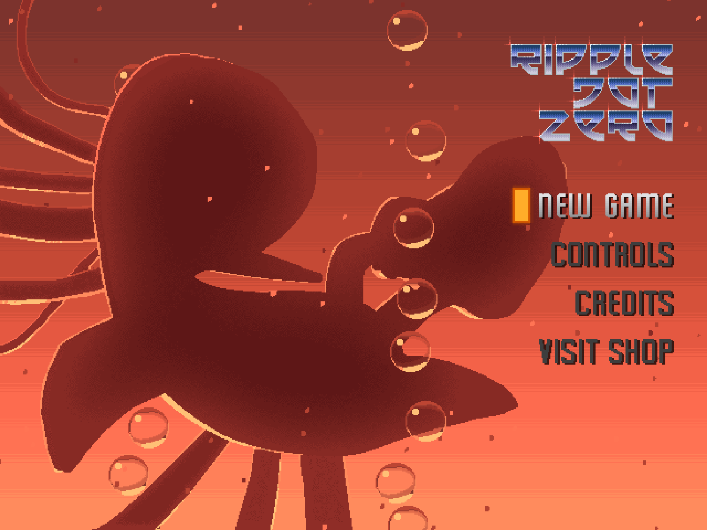
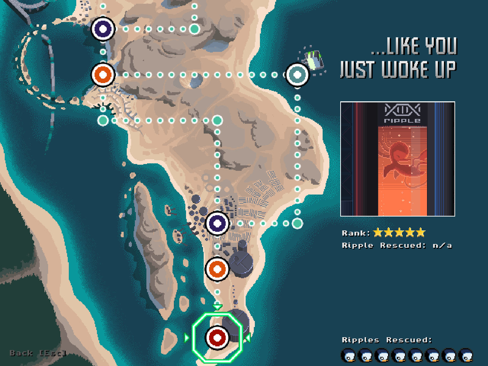
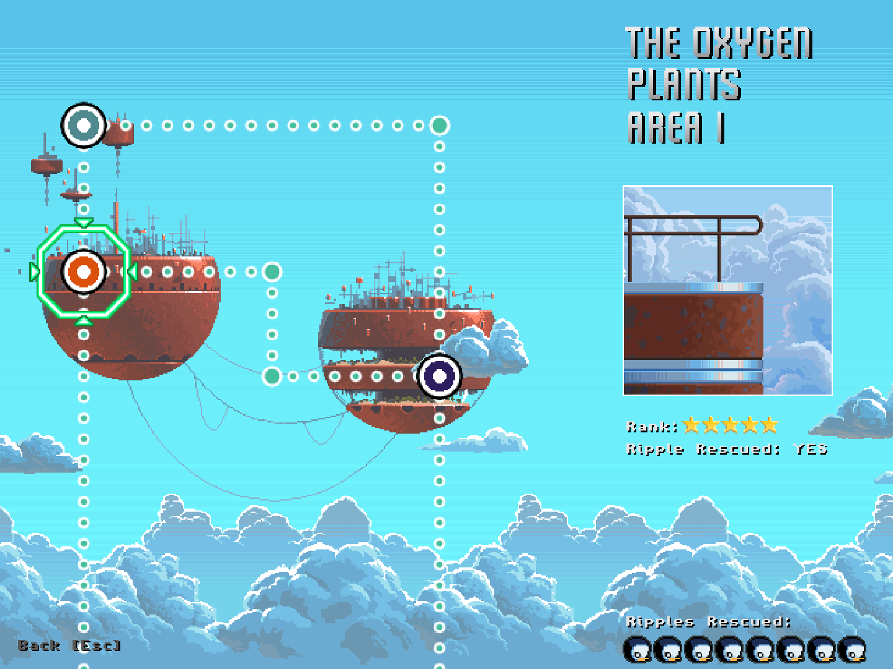
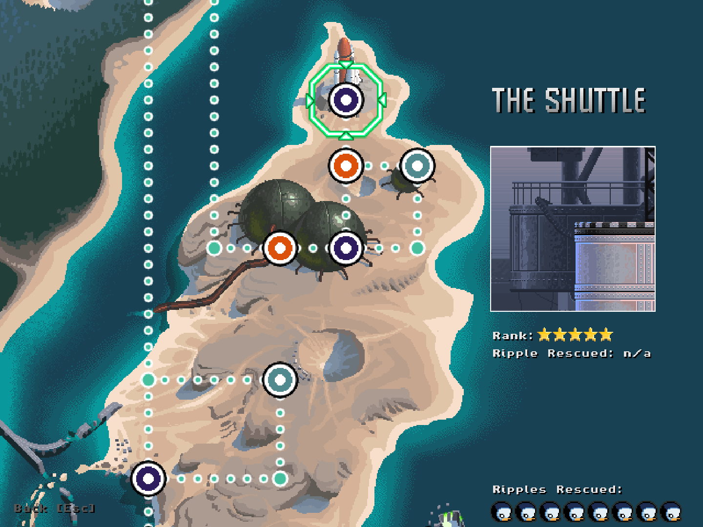
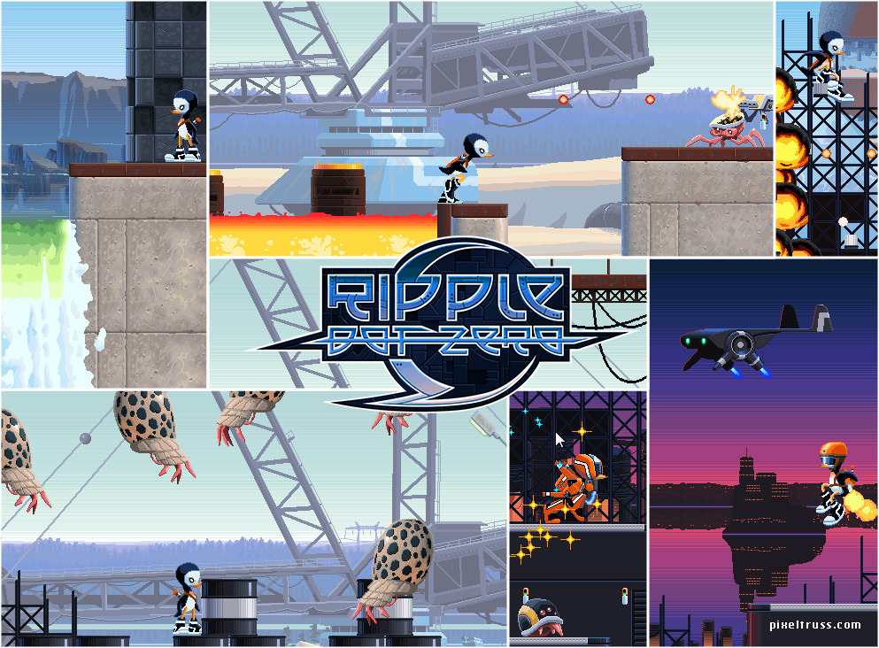

# Ripple Dot Zero Archive

> [!IMPORTANT]
> I am NOT affiliated with **Pixeltruss** or any individuals who worked on Ripple Dot Zero.
> All game assets, visuals, audio, and original concepts are the property of their respective owners.
No ownership is claimed over any original material. 
> This project exists solely for **archival purposes**, and is shared out of appreciation for the original work.

> [!WARNING]
> SPOILERS AHEAD

## Levels

|Level type|Count|
|---|---|
|Regular levels|12 (including ending cutscene)|
|Hidden (areas)|4|
|Bonus levels|8 (accessible through Terrarrium hidden area)|

# Maps & main screen

## Promotional material + Logo

## Ending cutscene

https://github.com/user-attachments/assets/2028d8ea-413f-475d-ad4c-ffcf939cf33a

## External Links

Official OST: [https://satunast.bandcamp.com/album/ripple-dot-zero-ost](https://satunast.bandcamp.com/album/ripple-dot-zero-ost)

Official website (no longer working): [https://www.rippledotzero.com/](https://www.rippledotzero.com/)

Tommy Salmonsson blog: [https://www.salomonsson.se/tags/ripple-dot-zero.html](https://www.salomonsson.se/tags/ripple-dot-zero.html)

Ripple Dot Zero in Simon Stålenhag's tumblr post: [https://stalenhag.tumblr.com/post/73939487538/me-and-my-childhood-friend-tommy-salomonsson-had-a](https://stalenhag.tumblr.com/post/73939487538/me-and-my-childhood-friend-tommy-salomonsson-had-a)
